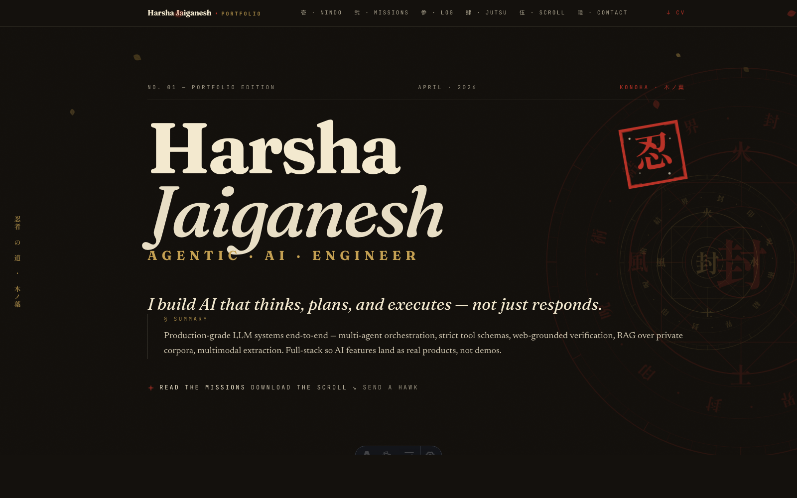
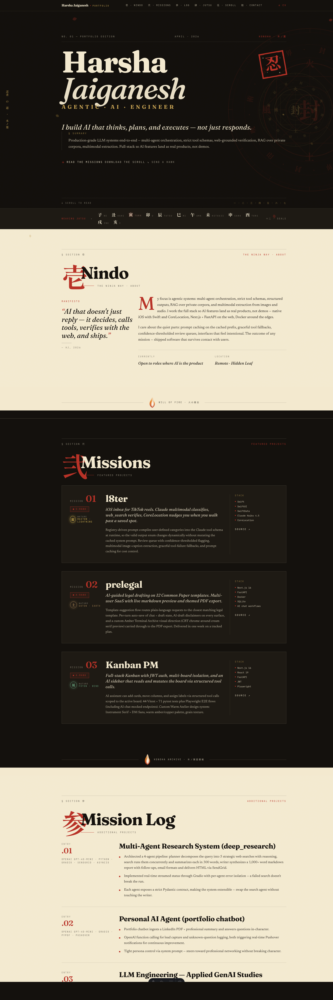

# 木ノ葉 · Portfolio

**Live:** [harsha-jaiganesh.netlify.app](https://harsha-jaiganesh.netlify.app)

A Japanese-editorial portfolio site for **Harsha Jaiganesh** — Agentic AI engineer. Built with Astro, Tailwind v4, and Fraunces + Newsreader + Shippori Mincho typography. Paper & ink alternating sections, hanko seal stamps, kanji numerals, Fūinjutsu sealing circle, hand-seal strip, chakra-nature tags, and Will of Fire dividers.

[](https://harsha-jaiganesh.netlify.app)

## Preview

<p align="center">
  
</p>

## Sections

| No. | Kanji | Section         | English             |
|-----|-------|-----------------|---------------------|
| 壱  | 道    | Nindo           | About               |
| 弐  | 巻物  | Missions        | Featured work       |
| 参  | 任務  | Mission Log     | Additional projects |
| 肆  | 術    | Jutsu           | Skills              |
| 伍  | 巻物  | Scroll          | Resume              |
| 陸  | 手紙  | Messenger Hawk  | Contact             |

## Stack

- **Astro** (static output, zero runtime JS by default)
- **Tailwind v4** (CSS-first `@theme` tokens)
- **TypeScript**
- Self-hosted variable fonts: Fraunces, Newsreader, Shippori Mincho, JetBrains Mono
- Deployed on **Netlify**

## Develop

```bash
npm install
npm run dev      # http://localhost:4321
npm run build    # static output to dist/
npm run preview  # serve the build locally
```

## Content

All editable content lives in two JSON files:

- `src/data/projects.json` — featured missions (title, rank, chakra nature, stack, summary)
- `src/data/experience.json` — additional projects for the Mission Log

The resume PDF lives at `public/resume.pdf`.

## Structure

```
src/
├── pages/index.astro          single-page composition
├── layouts/Base.astro         shared head, fonts, meta
├── components/
│   ├── Hero.astro             editorial masthead + rotating sealing circles
│   ├── Nindo.astro            about section (paper)
│   ├── Missions.astro         featured projects (ink)
│   ├── MissionLog.astro       additional projects (paper)
│   ├── Jutsu.astro            skills (ink)
│   ├── Scroll.astro           resume with unfurl toggle (paper)
│   ├── MessengerHawk.astro    contact (ink)
│   ├── SealingCircle.astro    Fūinjutsu SVG with rotating rings
│   ├── HandSealStrip.astro    12 zodiac hand seals with staggered flicker
│   ├── FireDivider.astro      Will of Fire transitions between paper/ink
│   ├── ChakraNature.astro     火/水/風/土/雷 badges
│   ├── FallingLeaves.astro    drifting Konoha leaves
│   ├── Hanko.astro            animated red seal stamp
│   ├── SectionHeader.astro    kanji numeral + display heading
│   └── Nav.astro              sticky navigation
├── data/
│   ├── projects.json
│   └── experience.json
└── styles/global.css          Tailwind + tokens + animations
```

## License

Content © Harsha Jaiganesh. Code: MIT.
